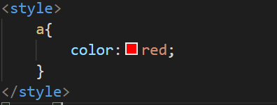

# CSS

css가 있기 전에 태그가 있었음 →웹페이지로서의 정보를 전달하기에 불필요해짐(html은 오로지 웹페이지의 정보만을 전달하기 위함)→css를 이용하는 것이 html을 이용해서 디자인하는 것보다 훨씬 효과적임

- 태그는 헤드에 씀, style태그 안쪽에 있는 내용은 css니까 css라는 문법에 맞게 해석해서 처리해야 한다는 의미

- a태그에 있는 모든 글씨색을 빨간색으로 한다는 의미
- style이라는 속성을 직접사용하면 그 속성의 값을 css로 해석함
- style에서 하나의 선택자에서 여러개의 속성을 지정할 수 있는데 하나의 속성이 끝나면 ;을 붙여줌으로써 구분을 해줘야 함

- 웹페이지에 있는 모든 a태그를 선택한다는 의미로 selector이라고 함
- 선택자가 주는 태그들에 대해서 어떤 효과를 줄 것인가에 대한 선언,declaration,효과

- class선택자:그룹화 한다(하나로 묶는다) , “.”은 웹페이지에서 모든 클래스가 saw인 태그를 가르키게 해줌, id다음 우선순위
- id선택자:우선순위가 가장 높음, 유일무이함(하나밖에 없음, id선택자의 값이 active라는 태그는 한번밖에 나오지 못함), 가장 구체적, 선택자를 사용할 때 “#”을 씀
- tag선택자:가장 포괄적임, 우선순위가 가장 낮음

[우선순위]

id > class > tag 

같은 우선순위라면 순서(선택자에서 써준)에 따라서 적용이 됨

[조각조각 팁]

css의 주석 /* */

display:none(안 보이게 하는 속성)

[https://caniuse.com/](https://caniuse.com/)   css,html,자바스크립트에서 사용하는 기술들 통계보여줌

- block level element(element랑 tag랑 똑같음):화면 전체를 사용하는 태그(ex: h1태그)
- inline element:자기 자신의 크기만큼의 부피를 사용하는 태그(ex:a태그)

      → 이것들은 기본값일 뿐 display속성을 이용하여 바꿔줄 수 있음 (display:block;)

- 선택자에서 ,를 이용하여 코드를 줄일 수 있음

→위에 있는 3줄이랑 마지막 한 줄이랑 똑같은 의미임

- 패딩과 마진
- content크기를 조절할때 가로는 width, 세로는 hight를 사용해서 조절
- 박스 모델이란 html태그 하나하나를 일종의 박스로 취급하여 부피감을 결정하는 것→디자인에서 핵심적인 요소
- 
태그:아무런 의미없이, 기능없이 css를 사용하기 위해서 사용하는 태그,블록 레벨 엘레먼트
- 태그:div태그랑 동일함, 인라인 엘러먼트

- grid를 사용하기 위해서는 태그들을 감싸는 부모태그를 만들어줌
- display속성에서 grid를 사용
- navigation부분은 150px을 사용, article부분은 나머지 픽셀을 사용한다는 뜻

→웹페이지에 있는 모든 ol중에 부모가 grid인 ol 셀렉터

- 반응형디자인:화면의 크기에 따라서 웹페이지의 각 요소들이 반응하여 동작하게 되는 것→미디어쿼리가 이것을 가능하게 해 주는 기능=특성들에 따라서 어떠한 조건이 만족할 때만 css의 내용이 동작하게 해 주는 것=미디어쿼리

→둘이 같은 뜻임 /화면의 크기가 최소 800px이라면, 화면크기가 800px이상이라면 

→최대 800px, 화면이 800px이하라면 div태그는 화면에서 보이지 않음

- style.css파일을 따로 만들어서 link태그를 통해 파일연결 가능
