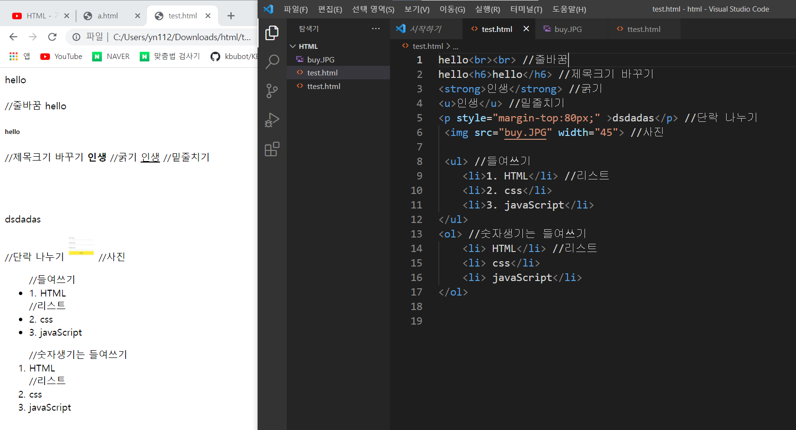

# HTML

HTML:하이퍼텍스트(링크)를 가장 중요한 특징으로 하는 마크업이라는 형식을 가진 컴퓨터 프로그래밍 언어 →만들고 싶은 웹 페이지가 있을 때 그 웹 페이지가 어떻게 생겼고, 어떤 정보를 가지고 있어야 되는지를 웹 브라우저에게 명령할 때 사용하는, 우리도 이해할 수 있고, 웹 브라우저도 이해할 수 있는 언어를 말함

**<></>←태그** 

앞에있는 태그는 열리는 태그, 뒤에있는 태그는 닫히는 태그라고 함(/를 붙임) 

- <strong>굵게</strong>
- <h1>제목을 만들어줌(굵고 크도 줄바꿈도 해줌)</h1>(숫자를 키워줄수록 작아짐)
-   줄바꿈, 닫는 태그가 없음
- 

단락을 나누는 태그, 단락의 시작과 끝 표시
-  사진을 넣을 때 사용하는 태그
- <li></li> 리스트, 앞에 저 동그라미가 붙여짐
- <li>태그를 감싸는 태그(부모태그)로
    - <ul></ul> 단락을 나눠줌 (unordered list)
    - <ol></ol>숫자표시를 해줌 대신 앞에 동그라미는 없음 (ordered list)
- <title></title> 웹페이지 이름을 바꿔주는 태그
- <meta charset="utf-8"> utf8로 문서를 읽어와라, 한국어가 안 깨지도록 나오게 하는 것임
- 본문을 설명하는 태그는 <head>태그로 묶고 제목을 설명하는 태그는 <body>태그로 묶기로 약속함
- 모든 태그를 묶는 태그는 <html>, 맨 위에 쓴 문장은 관용적으로 이 문서는 html에 있다는 뜻

-  링크를 걸 때 사용하는 태그
