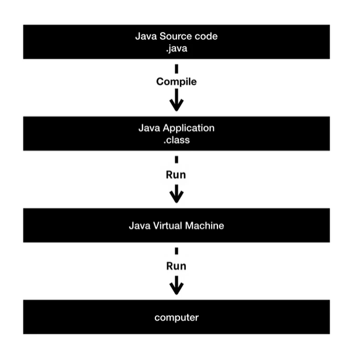

# JAVA

- helloworldapp.java라는 파일을 실행시키면 java는 파일의 이름과 똑같은 클래스를 찾고 클래스 안에 있는 main이라는 약속된 이름의 매소드를 찾음 → 그 안에 있는 중괄호 안에 위치해있는 코드를 실행시키기로 약속해 놓음

즉, main안에 코드를 작성해놓으면 컴퓨터를 실행했을때 그 코드대로 동작이 된다!

- java의 동작원리

원인을 부름(sorce code language) → 결과를 부름(application program)

 즉, java라는 컴퓨터 프로그래밍 언어를 통해서 컴퓨터에게 시키고 싶은 일을 시키는 것

자기가 하고자 하는 일을 담은, 확장자가 java인 파일을 작성함(=java라는 컴퓨터 언어에 맞게 만들어진 소스코드, 소스코드는 사람만이 이해할 수 있음) → 컴파일(기계가 확장자가 java인 소스코드를 이해할 수 있게 전환하는 작업) → 소스코드를 만들고 저장버튼을 누르면 .class라는 파일이 만들어짐(java의 기술을 응용해서 만든 app) → Run버튼을 클릭하면 java virtual machine이 확장자가 class인 파일을 읽어서 컴퓨터를 동작시키게 됨

- sout쓰고 ctrl+스페이스 누르면 System.out.println이 나옴
- 자바에는 여러 데이터 타입이 있고 데이터타입별로 처리하는 연산방법이 다름
    
    →엄격하게 분리해야함
    
    - 문자는 “”를 이용하여 묶음
        
        ex)System.out.println(”6”)이면 숫자가 아닌 문자6임 
        

즉,  프로그래밍에서는 데이터의 타입이 있고 데이터 타입별로 그 타입에 어울리는 연산방법이 있기 때문에 엄격하게 구분을 한다

- 숫자 연산자

- 수학적 작업도 가능

- 자바에서 문자열(String)은 “”을 사용, 문자(한 글자,Character)는 ‘’을 사용  (엄격하게 구분해야 함)
    - 줄바꿈 (\n), 큰따옴표 출력(\”)
    - 문자열의 글자수세기("Hello World".length())
    - 문자열의 글자 바꿔주기("Hello, abc...bye".replace("abc", "def"))
- 변수를 만들 때는 그 변수가 어떤 데이터 타입을 담을 수 있는지를 명확하게 표현해야함
    
    → 변수란 값에 이름을 부여하는 것
    
    - int 정수
    - double 실수
    - String 문자열

 

- 데이터 타입의 변환(Casting)

1.1을 정수로 바꾸면 소수점 아래에 있는 것들은 사라지므로 손실이 일어남→명시적으로 형변환

1을 실수로 바꾸면 손실이 일어나지 않음→자동적으로 실수로 형변환 가능

정수1을 문자열로  String f=Integer.toString(1);

데이터 타입이 무엇인지 알려줌 f.getClass()

- 프로그래밍을 통해서 얻을 수 있는 효과는  컴퓨터가 우리가 쓴 문장 하나하나를 순차적으로 실행이되는 걸 통해서 사람이 잘 못하는 일을 기계에게 위임해서 자동화할 수 있다, 그것을 해주는 컴퓨터 언어중에 하나가 JAVA
- 디버거
    - 의도하지 않은 문제:버그
    - 버그를 잡는 행위:디버깅
    - 디버깅을 할 때 사용하는 도구:디버거
- 입력과 출력
    - 프로그램:들어오는 정보인 입력을 처리해서 출력을 만들어내는 기계라고 할 수 있음
    
    
    
- arguments & parameter
    - 매개변수(parameter):프로그램을 사용하는 사람과 프로그램 사이의 값을 매개해줌 (args)
        
        사용자가 입력한 값을 args라는 매개변수를 통해 받는다,
        
        파라미터에 여러개의 값을 받아올 때는 args[0],args[1]과 같은 배열을 이용함
        
        이클립스에서 RunConfiguration-arguments를 통해서 가능
        

- 개발도구를 사용하지 않고 직접 컴파일하는 법

cmd 실행 →cd 소스코드가 있는 곳 path→javac 소스코드 이름.java→java 소스코드이름(실행)

java에게 Program클래스 파일을 실행하라고 명령→자바가 클래스 이름과 같은 클래스 파일을 찾음→main을 찾음→main안에 있는 코드들을 순차적으로 실행하고 종료

→라이브러리 경로를 지정해줘야 하는 경우

class path가 ib폴더 아래에 있다라는 뜻, .은 현재 디렉토리라는 의미

Exception:에러

→입력값을 따로 지정해줘야하는 경우

- 자바 문서 링크 [https://docs.oracle.com/javase/7/docs/api/](https://docs.oracle.com/javase/7/docs/api/)
    - class:서로 연관된 변수와 매소드를 모아서 이름을 붙인 것
    - 패키지:비슷한 성격의 클래스를 모아서 이름을 붙인 것
    - 필드:변수
    
    
    
- 클래스가 하는 작업이 1회용이 아닌 긴 맥락의 꼬리에 꼬리를 무는 작업이라면 클래스를 복제한 인스턴스를 만들어서 그것을 사용할 수 있도록 사용자에게 제공하는 것이 더 효율적이기 때문에 그에 맞춰서 코드를 제작하게 된 것
    
    constructor(생성자)가 없는 애들은 1회용(math처럼)
    
    constructor(생성자)가 있는 애들은 인스턴스를 만드는 것이 허용되어 있음
    
    new 뒤에 있는 애가 constructor →constructor앞에 new를 붙이면 복제되서 p1이라는 인스턴스가 되고 그 인스턴스에 어떤 값이 올수 있는지를 규제하기 위해 앞에 Printwriter이라는 클래스의 이름을 적음
    
    
    
- 상속:자식클래스가 부모클래스로부터 변수나 매소드를 가져와서 사용할 수 있게 하는 것
- 오버라이드:부모클래스의 매소드를 덮어쓰기하여 자기자신의 클래스만의 매소드로 사용하는것

- 배열을 도입함으로써 각각의 값들이 연관된 것이라는 것을 알 수 있음, 하나의 변수만 가지고 있음→배열이란 서로 연관된 데이터를 정리정돈하는 수단이라고 볼 수 있음

- 메소드:서로 연관된 코드를 그룹핑해서 이름을 붙인 정리정돈의 상자
- 클래스(객체):서로 연관된 변수와 메소드를 그룹핑하여 이것에 이름을 붙인 것, 정리정돈의 상자
- 인스턴스:하나의 클래스를 복제해서 서로 다른 데이터의 값과 서로 같은 메소드를 가진 복제본을 만드는 것
    
    메소드로 구조를 잡고 메소드와 변수를 그룹핑하여 클래스로 구조를 잡고 클래스를 복제한 인스턴스를 통해서 또 다른 구조를 만드는 방식
    

# **JAVA 제어문**

- Boolean Datatype-참이다, 거짓이다를 표현할 때 쓰는 데이터타입
    - true
    - false
- 비교연산자:왼쪽에 있는 값과 오른쪽에 있는 값을 비교해서 그 결과가 무엇이냐에 따라서 true,false 둘 중에 하나의 값을 만들어내는 연산자
- == vs equals
    
    자바의 데이터 타입
    
    
    
    “==” : 동등비교 연산자는 같은 곳에 있냐라는 것을 따져보는 것
    
    “equals”:내용이 같은지를 따져보는 취지로 만들어지는 매소드
    
    원시데이터타입비교→ 동등비교연산자
    
    원시데이터타입이 아닌 것을 비교→equals사용
    
    문자열은 동등비교연산자로 해도 가능하기도 함
    
    
    
- 논리연산자
    - and연산자:&&
    - or연산자:||
    - not연산자:!true=false

- 반복문

- 배열

인덱스:0,1,2와 같은 자릿수, 우리가 원하는 값을 찾을 때 쓰는 색인

원소:각각의 배열의 값

# 객체지향프로그래밍

- 클래스:서로 연관된 매소드와 변수를 그룹핑하여 이름을 붙인 것
- 클래스를 중심으로 프로그램의 구조를 만들어가는 컴퓨터 프로그래밍 방법론→객체지향 프로그래밍
- 이러한 방법론을 언어 차원에서 제공하는 언어들→ 객체지향언어
- 똑같은 클래스이지만 앞에 new를 붙여서 f1이라는 변수에 담기는 복제본을 만듦, 이 복제본은 data.txt라는 파일의 내용을 저장하겠다는 상태를 가지고 있는 복제본
    
    즉, 클래스의 복제본을 만들어서 그것을 제어하는 경우
    

        클래스를 직접사용하는 경우

        Class : System, Math, FileWriter

        instance : f1,f2

- 클래스의 형식
    
    Class라는 키워드를 사용한 후 클래스의 이름을 정함
    
    중가로 안에 클래스의 소속인 변수나 메소드를 담아주면 됨
    
    클래스의 소속인 변수나 메소드→멤버
    
    파일의 이름과 똑같은 이름의 클래스 앞에는 public을 붙임, public은 한 번만 등장
    
    하나의 파일 안에서 클래스를 여러개 만들면 각각의 클래스가 파일로써 존재함
    

- 인스턴스
    
    static키워드:클래스의 소속
    
    static키워드 없는 것:인스턴스의 소속
    
    →인스턴스의 소속이라고 봐도 됨
    

- static
    
    클래스의 변수를 바꾸면 모든 인스턴스의 변수의 값이 바뀜
    
    인스턴스에서도 클래스의 변수를 바꾸면 클래스의 변수가 바뀜과 동시에 모든 인스턴스의 변수도 바뀜
    
    회색으로 표시된 애들은 서로 연결되어있다고 봐도됨→수정하면 연결되어 있는 애들은 모두 같이 수정됨(본체공유느낌)
    
    
    
- 생성자:초기에 주입할 필요가 있는 값을 전달하거나, 초기의 작업을 수행하도록 할 때 씀
    
    클래스와 똑같은 이름의 메소드를 지정, static, return 데이터타입을 지정하지 않음
    
- this키워드:클래스가 인스턴스화 되었을 때의 인스턴스를 가르키는 특수한 이름

Print 메소드의 생성자의 delimiter매개변수를 가르키게 됨

→this.delimiter로 바꿔주면 인스턴스의 delimiter변수를 가르키게 됨

